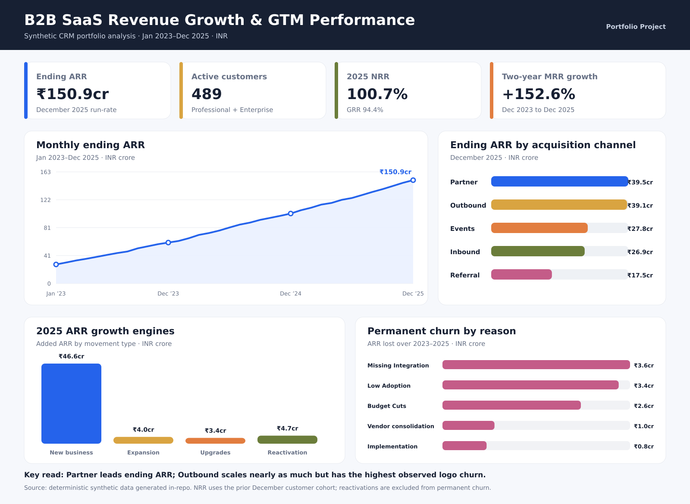
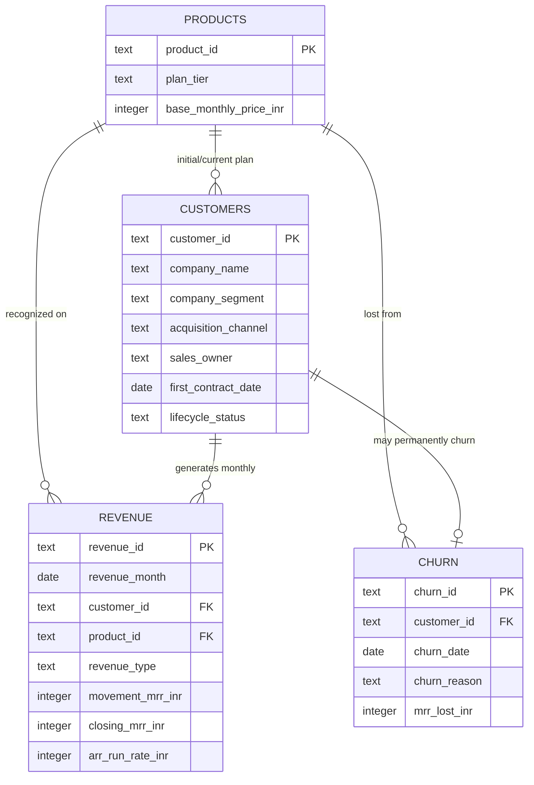

# B2B SaaS Revenue Growth & GTM Performance



An end-to-end analytics portfolio project that models how a fictional B2B SaaS CRM business grew recurring revenue from January 2023 through December 2025.

The project connects customer acquisition, sales ownership, product tier, monthly recurring revenue, expansion, upgrades, reactivation, and permanent churn. All companies and records are deterministic synthetic data; no confidential or real customer data is used.

## Executive summary

- **Ending ARR reached ₹150.9 crore** in December 2025 across 489 active Professional and Enterprise customers.
- **The retained 2024 customer cohort produced 100.7% NRR in 2025**, while GRR was 94.4%. Expansion and upgrades offset permanent churn, but only narrowly.
- **Partner was the largest ending-ARR channel at ₹39.5 crore.** Outbound reached ₹39.1 crore, but its 14.1% observed logo churn was the highest of the five channels.
- **Post-sale growth added ₹12.0 crore of ARR in 2025** through expansion, upgrades, and reactivation. Missing integrations were the largest permanent-churn reason by ARR lost.
- **Growth stayed positive but decelerated.** Year-over-year ARR growth slowed from 71.0% in 2024 to 47.7% in 2025, while active-customer growth slowed from 60.2% to 41.3%.
- **Customer count did not contract.** Active customers increased every observed month; 2025 added 163 new customers and recorded 27 permanent churns.
- **Mid-Market had the higher observed logo-churn rate.** Customers starting on Professional recorded 8.3% observed permanent churn versus 6.6% for Large Enterprise customers starting on Enterprise.

## Business questions

1. How did MRR and ARR change over 36 months?
2. Which acquisition channels produced the strongest ending ARR and customer quality?
3. How much growth came from new business versus expansion, upgrades, and reactivation?
4. Did the existing customer base retain and expand revenue?
5. Which churn reasons destroyed the most recurring revenue?
6. Which product tiers, customer segments, and sales owners contributed most to the ending run-rate?
7. Are ARR and customer counts both growing, and is either growth rate decelerating?
8. How many customers are added, reactivated, permanently churned, and retained each month?
9. Which customer segment and starting plan have the highest observed permanent logo churn?
10. Is ARR growth coming mainly from more customers or from higher ARR per active customer?

## Data model



The model deliberately stays compact at four tables. `revenue` has one row per active customer-month. Reactivation represents a temporary suspension followed by a return; those customers never appear in `churn`, which contains permanent losses only.

## KPI definitions

| KPI | Definition |
|---|---|
| MRR | Sum of `closing_mrr_inr` for all active customer rows in a month. |
| ARR run-rate | Monthly closing MRR × 12; it is a run-rate, not booked contract value. |
| Recognized revenue | Sum of monthly recurring revenue recognized during the analysis period. |
| NRR | Ending MRR from the prior December customer cohort ÷ that cohort’s starting MRR. New customers are excluded; expansion, upgrades, reactivation, and churn are reflected. |
| GRR | Ending cohort MRR capped at each customer’s starting MRR ÷ starting cohort MRR. Expansion is excluded from the numerator. |
| Observed logo churn | Permanently churned customers ÷ all customers acquired through a channel during the modeled history. This is descriptive, not an annual churn rate. |

## Key findings

### 1. Revenue growth was broad and sustained

Ending ARR increased from ₹27.7 crore in January 2023 to ₹150.9 crore in December 2025. December 2025 MRR was 152.6% above December 2023 MRR. The trend includes 36 monthly observations, avoiding a conclusion based on only a few endpoints.

### 2. Partner and Outbound need different GTM actions

Partner led ending ARR and combined high average ARR with moderate churn. Outbound reached nearly the same scale but had the highest observed logo churn at 14.1%. The modeled implication is to keep Partner as a quality-growth channel while tightening Outbound qualification, implementation fit, and early customer-success coverage.

### 3. Enterprise revenue dominates, but upgrades matter

Large Enterprise customers on the Enterprise plan contributed 65.7% of ending ARR. An additional 10.8% came from Mid-Market customers that upgraded into Enterprise. Upgrade ARR is therefore both a revenue lever and evidence of an upward customer path.

### 4. Retention is healthy, not risk-free

NRR improved from 100.2% in 2024 to 100.7% in 2025, but 2025 GRR was 94.4%. Expansion offset churn, so the net metric alone would hide meaningful gross losses. Missing integrations and low adoption together represented 60.8% of modeled ARR lost to permanent churn.

### 5. The portfolio is growing, but growth momentum is slowing

ARR and active-customer counts increased in every observed month, so the dataset does not show customer-base contraction. The more important signal is deceleration: year-over-year ARR growth declined from 71.0% in 2024 to 47.7% in 2025, while active-customer growth declined from 60.2% to 41.3%. Average ARR per active customer still increased 4.5% in 2025, confirming that customer mix and post-sale growth contributed beyond new-logo volume.

### 6. Segment churn requires two different retention actions

Mid-Market customers starting on Professional recorded 25 permanent churns from 301 acquired customers, an observed rate of 8.3%. Large Enterprise customers starting on Enterprise recorded 15 churns from 228 customers, or 6.6%. However, Enterprise losses removed more ARR because each account was larger. The modeled action is broader logo-retention coverage for Mid-Market and high-touch prevention for fewer, higher-value Enterprise risks.

## Recommendations

1. Prioritize Partner and Events for Enterprise acquisition while monitoring lead volume and sales-cycle economics in a real implementation.
2. Add stricter Outbound qualification for integration fit and implementation readiness.
3. Build a customer-success playbook around integration adoption during the first six months.
4. Create a Professional-to-Enterprise upgrade signal using usage, seat growth, and integration demand.
5. Track NRR and GRR together so expansion does not conceal avoidable churn.
6. Add monthly customer-flow and growth-quality monitoring: new logos, permanent churn, net active-customer change, ARR growth, customer growth, and average ARR per active customer.

## Repository structure

```text
├── data/                 # Four synthetic CSV tables
├── database/             # SQLite database and schema
├── sql/                  # Data quality, KPI, growth, GTM, retention and churn queries
├── scripts/              # Deterministic generator, analysis runner and visual builder
├── analysis/outputs/     # Query results and headline metrics
├── assets/               # Dashboard and LinkedIn-ready visuals
├── docs/                 # Data dictionary, methodology, reports and learning journey
└── report/               # Portable analytical report artifacts
```

## Learning journey and transparency

The project preserves two handwritten SQL drafts that preceded the final implementation. They demonstrate the original practice around conditional aggregation, win rate, won ARR, pipeline value, joins, and segment grouping. The drafts reference conceptual `accounts` and `opportunities` tables and are clearly separated from the runnable four-table project SQL.

See [`docs/learning_journey.md`](docs/learning_journey.md) for the original notes and an explanation of how the work evolved into reproducible queries.

## Reproduce locally

Requires Python 3.10+ and SQLite support from the Python standard library.

```bash
python3 scripts/generate_data.py
python3 scripts/run_analysis.py
python3 scripts/build_visuals.py
```

Optional PNG export when Inkscape is installed:

```bash
inkscape assets/dashboard_preview.svg --export-filename=assets/dashboard_preview.png
inkscape assets/linkedin_project_summary.svg --export-filename=assets/linkedin_project_summary.png
```

## Skills demonstrated

- Relational data modeling and referential integrity
- SQL CTEs, conditional aggregation, window functions, cohort joins, ranking, and defensive denominators
- Recurring-revenue KPI design: MRR, ARR, NRR, GRR, customer growth, churn, expansion, upgrade, and reactivation
- GTM segmentation by acquisition channel, sales owner, product tier, customer segment, and churn reason
- Growth-quality diagnostics comparing ARR growth, customer growth, average ARR per customer, new logos, and permanent churn
- Reproducible synthetic data generation, QA, visualization, and executive communication

## Important limitations

- The dataset is synthetic and designed for portfolio learning; the recommendations demonstrate analytical reasoning, not a real company decision.
- The four-table scope has no lead, opportunity, activity, quota, or marketing-spend facts. It cannot support funnel conversion, win rate, pipeline coverage, CAC, ROAS, or sales-cycle analysis.
- ARR is a monthly run-rate derived from modeled MRR, not audited GAAP revenue or signed contract value.
- Channel and segment churn comparisons are descriptive because customers have different acquisition dates and exposure periods.

See [the data dictionary](docs/data_dictionary.md), [methodology](docs/methodology.md), and [validation report](docs/validation_report.md) for details.
