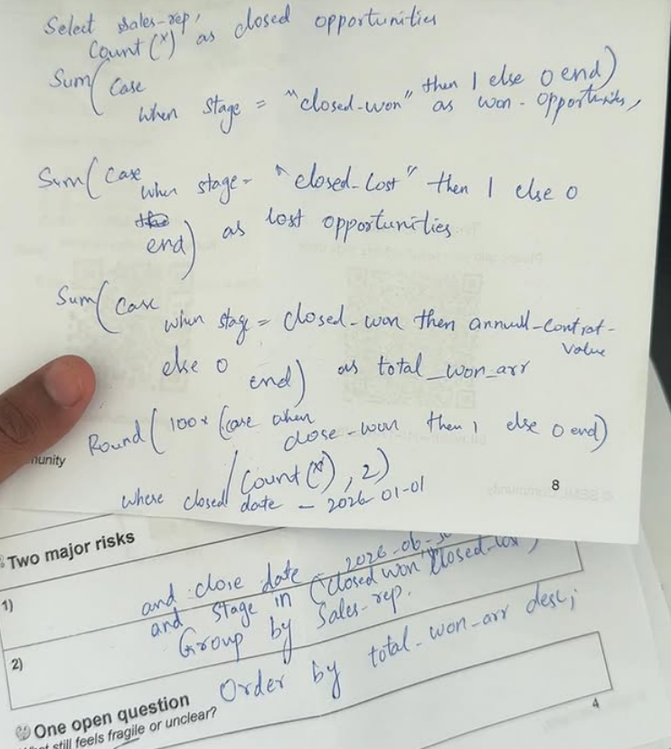
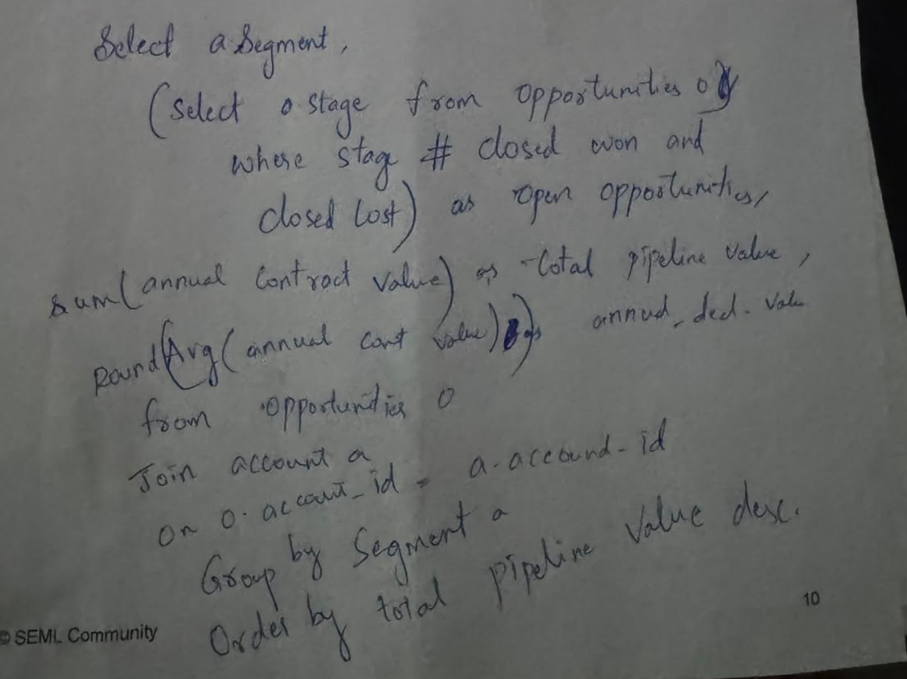

# SQL learning journey

This portfolio project began with handwritten SQL practice before the final data model and production queries were built. The notes below are preserved for transparency: they show the starting point, not polished or runnable repository SQL.

## Draft 1: win rate and won ARR by sales representative

The draft practices conditional aggregation with `SUM(CASE WHEN ...)`, counts closed-won and closed-lost opportunities, calculates a win-rate percentage, and sums annual contract value for won opportunities.

## Draft 2: pipeline value by account segment

The draft explores account-to-opportunity joins, pipeline value, average deal value, grouping by segment, and ordering by pipeline value.

## How the idea evolved

The handwritten exercises use conceptual `accounts` and `opportunities` tables. Those tables are not part of this repository's final four-table model, so the notes are not presented as executable project queries. The final project translates the same analytical habits into tested SQLite queries over `customers`, `products`, `revenue`, and `churn`:

- conditional aggregation for acquisition, expansion, upgrade, reactivation, and churn;
- segmentation by acquisition channel, company segment, starting plan, and sales owner;
- window functions for year-over-year growth and prior-period comparisons;
- cohort calculations for NRR and GRR;
- reproducible outputs, independent validation, and automated checks.

This separation is intentional: the notes show the learning process, while the `sql/` folder contains the reviewed, runnable analysis.
